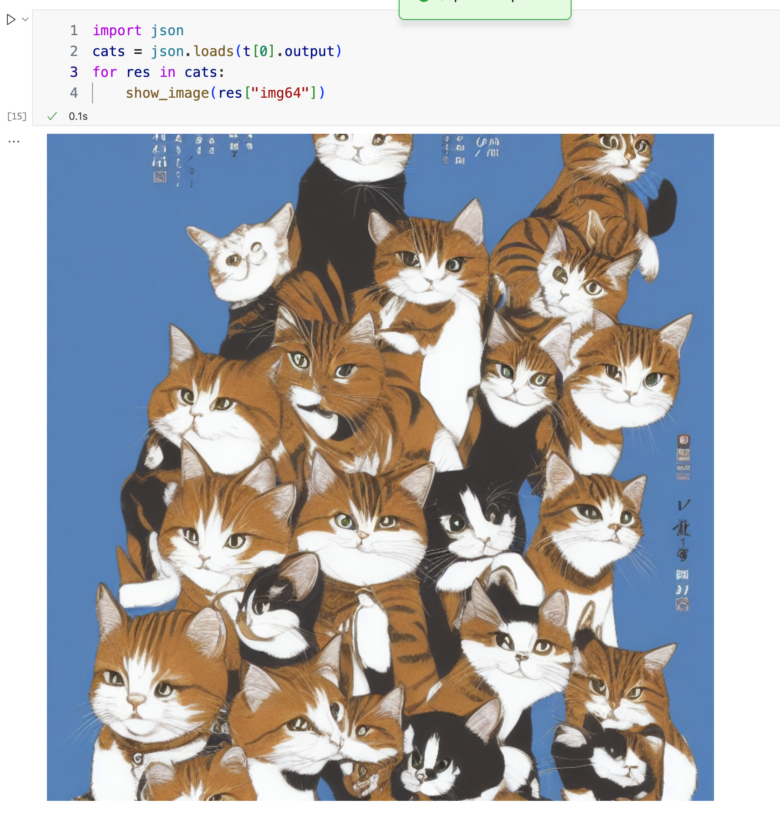

<p align="center">
  <picture>    
    
  </picture>
</p>

<h3 align="center">
Easy, fast, and cheap pretrain,finetune, serving, python api for everyone
</h3>

<p align="center">
| <a href="./docs/zh/"><b>English</b></a> | <a href="./docs/en/"><b>中文</b></a> |

</p>

---

*Latest News* 🔥

- [2024/04] Release Byzer-LLM 0.1.87
...
- [2023/12] Release Byzer-LLM 0.1.30

---


Byzer-LLM is Ray based , a full lifecycle solution for LLM that includes pretrain, fintune, deployment and serving.

The unique features of Byzer-LLM are:

1. Full lifecyle: pretrain and finetune,deploy and serving support
2. Python/SQL API support
3. Ray based, easy to scale

---

* [Versions](#Versions)
* [Installation](#Installation)
* [Quick Start](#Quick-Start)
* [How to connect Models from outside of Ray Cluster](#how-to-connect-models-from-outside-of-ray-cluster)
* Embedding/Rerank
    * [Embedding Model](#Embedding-Model)
    * [Embedding Rerank Model](#Embedding-Rerank-Model)
* [Quatization](#Quatization)
* [Supported Models](#Supported-Models)
* Serving
    * Backend
        * [vLLM Support](#vLLM-Support)
            * [vLLM troubleshooting](#vLLM-troubleshooting)
        * [DeepSpeed Support](#DeepSpeed-Support)
        * [llama_cpp Support](#llama_cpp-Support)
    * [Byzer-LLM OpenAI-Compatible RESTful API server](#byzer-llm-openai-compatible-restful-api-server)
* LLM && Python    
    * [Function Calling](#Function-Calling)
    * [Respond with pydantic class](#Respond-with-pydantic-class)
    * [Function Implementation](#Function-Implementation)
    * [LLM-Friendly Function/DataClass](#llm-friendly-functiondataclass)
    * [Prompt Function && Prompt Class](#Prompt-Function--Prompt-Class)
* Model Configurations    
    * [Model Meta](#Model-Meta)
    * [Chat Template](#Chat-Template)
    * [LLM Default Generation Parameters](#LLM-Default-Generation-Parameters)
    * [Pin Model Worker Mapping](#Pin-Model-Worker-Mapping)
    * [Model Worker Load Balance](#Model-Worker-Load-Balance)
* [SaaS Models](#SaaS-Models)
    * [qianwen/通义千问](#qianwen_通义千问)
    * [qianwen_emb/通义千问](#qianwen_emb_通义千问)
    * [qianwen_vl/通义千问多模态](#qianwen_vl通义千问多模态)
    * [yi_vl_plus/01万物多模态](#yi_vl_plus01万物多模态)
    * [baichuan/百川](#baichuan/百川)
    * [azure openai](#azure-openai)
    * [openai](#openai)
    * [zhipu/智谱](#zhipu/智谱)
    * [sparkdesk/星火](#sparkdesk_星火)         
    * [AmazonBedrock](#AmazonBedrock)
    * [Claude](#claude)
    * [Gemini](#gemini)
    * [Kimi](#moonshot_kimi)
    * [DeepSeek](#deepseek)
    * [Volcano TTS](#volcano_tts)
    * [OpenAI TTS](#openai_tts)
    * [Azure TTS](#azure_tts)
    * [OpenAI Image Generation](#openai_image_generation)
* [Multi Modal](#Multi-Modal)
* [StableDiffusion](#StableDiffusion)
* [SQL Support](#SQL-Support)
* [Pretrain](#Pretrain)
* [Finetune](#Finetune)
* [Stream Chat](#Stream-Chat)
* [Articles](#Articles)
* [Contributing](#Contributing)

---

## Versions
- 0.1.71:  stream_chat_oai/async_chat_oai add delta_mode parameter
...
- 0.1.5:  Support python wrapper for [byzer-retrieval](https://github.com/allwefantasy/byzer-retrieval)

---

## Installation

Recommend Env:

1. Conda:  python==3.10.11  
2. OS:     ubuntu 22.04
3. Cuda:   12.1.0 (Optional if you only use SaaS model)

```bash
## Make sure you python version is 3.10.11
pip install -r requirements.txt
## Skip this step if you have no Nvidia GPU
pip install vllm==0.3.3
pip install -U byzerllm
ray start --head
```

If your cuda version is 11.8, please check the following link to install vLLM:

https://docs.vllm.ai/en/latest/getting_started/installation.html

The key steps are:

```shell
As of now, vLLM’s binaries are compiled on CUDA 12.1 by default. However, you can install vLLM with CUDA 11.8 by running:

# Install vLLM with CUDA 11.8.
export VLLM_VERSION=0.2.6
export PYTHON_VERSION=310
pip install https://github.com/vllm-project/vllm/releases/download/v${VLLM_VERSION}/vllm-${VLLM_VERSION}+cu118-cp${PYTHON_VERSION}-cp${PYTHON_VERSION}-manylinux1_x86_64.whl

# Re-install PyTorch with CUDA 11.8.
pip uninstall torch -y
pip install torch --upgrade --index-url https://download.pytorch.org/whl/cu118

# Re-install xFormers with CUDA 11.8.
pip uninstall xformers -y
pip install --upgrade xformers --index-url https://download.pytorch.org/whl/cu118
```

### Raw Machine 

> Only tested on Ubuntu 20.04/22.04 CentOS 8.0

If your machine is a raw machine whithout GPU Driver and Cuda installed, you can use the following script to setup the machine:

```shell
git clone https://gitee.com/allwefantasy/byzer-llm
cd byzer-llm/setup-machine
```

Then switch to the ROOT user, and run the following script:

```shell
ROLE=master ./setup-machine.sh
```
This step will create a user called `byzerllm`.

Then switch to the `byzerllm` user, and run the following script:

```shell
ROLE=master ./setup-machine.sh
```

This time the script will automatically install the following software:

1. 
2. Conda
3. Nvidia Driver 535
4. Cuda 12.1.0
5. Ray
6. all the python packages in requirements.txt
7. Byzer-SQL/Byzer-Notebook

If you need to add more worker nodes to the Ray cluster, repeat the above steps on the worker nodes.
Notice that the `ROLE` should be `worker` on the worker nodes.

```shell
ROLE=worker ./setup-machine.sh
```

---

## Quick Start

### Command Line

Deploy a model:

```shell
byzerllm deploy --model_path /home/byzerllm/models/openbuddy-llama2-13b64k-v15 \
--pretrained_model_type custom/auto \
--gpu_gpus_per_worker 4 \
--num_workers 1 \
--model llama2_chat 
```


Then you can chat with the model:

```shell
byzerllm query --model llama2_chat --query "你好"
```

You can undeploy the model like this:

```shell
byzerllm undeploy --model llama2_chat
```

If you need to specify the Ray address, use `--ray_address`.

Here is another case to show you how to deploy SaaS model:

```shell
byzerllm deploy  --pretrained_model_type saas/qianwen \
--cpus_per_worker 0.01 \
--gpus_per_worker 0 \
--num_workers 1 \
--infer_params saas.api_key=xxxxx saas.model=qwen-max \
--model qianwen_short_chat 
```


### Python
```python
import ray
from byzerllm.utils.client import ByzerLLM,LLMRequest,InferBackend

ray.init(address="auto",namespace="default",ignore_reinit_error=True)

llm = ByzerLLM()

llm.setup_gpus_per_worker(4).setup_num_workers(1)
llm.setup_infer_backend(InferBackend.transformers)

llm.deploy(model_path="/home/byzerllm/models/openbuddy-llama2-13b64k-v15",
           pretrained_model_type="custom/llama2",
           udf_name="llama2_chat",infer_params={})


llm_client = ByzerLLM()
llm_client.setup_template("llama2_chat","auto")

v = llm.chat_oai(model="llama2_chat",conversations=[{
    "role":"user",
    "content":"hello",
}])

print(v[0].output)
```

The above code will deploy a llama2 model and then use the model to infer the input text. If you use transformers as the inference backend, you should specify the `pretrained_model_type` manually since the transformers backend can not auto detect the model type.

Byzer-LLM also support `deploy` SaaS model with the same way. This feature provide a unified interface for both open-source model and SaaS model. The following code will deploy a Azure OpenAI model and then use the model to infer the input text.


```python
import ray
from byzerllm.utils.client import ByzerLLM,LLMRequest,InferBackend
ray.init(address="auto",namespace="default",ignore_reinit_error=True)

llm = ByzerLLM()

llm.setup_gpus_per_worker(0).setup_num_workers(10)
llm.setup_infer_backend(InferBackend.transformers)

llm.deploy(pretrained_model_type="saas/azure_openai",
           udf_name="azure_openai",
           infer_params={
            "saas.api_type":"azure",
            "saas.api_key"="xxx"
            "saas.api_base"="xxx"
            "saas.api_version"="2023-07-01-preview"
            "saas.deployment_id"="xxxxxx"
           })


llm_client = ByzerLLM()
llm_client.setup_template("azure_openai","auto")

v = llm.chat_oai(model="azure_openai",conversations=[{
    "role":"user",
    "content":"hello",
}])

print(v[0].output)
```

Notice that the SaaS model does not need GPU, so we set the `setup_gpus_per_worker` to 0, and you can use `setup_num_workers`
to control max concurrency,how ever, the SaaS model has its own max concurrency limit, the `setup_num_workers` only control the max
concurrency accepted by the Byzer-LLM.

## How to connect Models from outside of Ray Cluster

The recommended way is to start a empty Ray worker in your target machine(e.g. Your web server machine):

```shell
ray start --address="xxxxx:6379"  --num-gpus=0 --num-cpus=0 
```

Then you can connect the Models from outside of the Ray cluster:

```python
import ray
from byzerllm.utils.client import ByzerLLM,LLMRequest,InferBackend

## connect the ray cluster by the empty worker we started before
## this code should be run once in your prorgram
ray.init(address="auto",namespace="default",ignore_reinit_error=True)

## new a ByzerLLM instance

llm_client = ByzerLLM()
llm_client.setup_template("llama2_chat","auto")

v = llm.chat_oai(model="llama2_chat",conversations=[{
    "role":"user",
    "content":"hello",
}])

print(v[0].output)
```

Or 


```python
from dataclasses import asdict
import json
import base64

import byzerllm
from byzerllm.utils.client.types import Templates

byzerllm.connect_cluster(address="ray://CLUSTER_IP:10001")

model_name = "zephyr_7b_chat"
llm = byzerllm.ByzerLLM()
llm.setup_template(model=model_name,template=Templates.default())
llm.setup_default_model_name(model_name)

t = llm.chat_oai(conversations=[{
    "role":"user",
    "content":"你好"}])
print(t[0].output)
```


## Embedding Model

The following code is a example of deploying BGE embedding model

```python
import ray
from byzerllm.utils.client import ByzerLLM,LLMRequest,InferBackend
ray.init(address="auto",namespace="default",ignore_reinit_error=True)
llm = ByzerLLM()

llm.setup_gpus_per_worker(0.4).setup_num_workers(2).setup_infer_backend(InferBackend.Transformers)
llm.deploy(
    model_path="/home/byzerllm/models/bge-large-zh",
    pretrained_model_type="custom/bge",
    udf_name="emb",
    infer_params={}
)   
```

Then you can convert any text to vector :

```python
t = llm.emb("emb",LLMRequest(instruction="wow"))
t[0].output
#output: [-0.005588463973253965,
 -0.01747054047882557,
 -0.040633779019117355,
...
 -0.010880181565880775,
 -0.01713103987276554,
 0.017675869166851044,
 -0.010260719805955887,
 ...]
```

The Byzer-LLM also support SaaS embedding model. The following code will deploy a Baichuan embedding model and then use the model to infer the input text.

```python
import os
os.environ["RAY_DEDUP_LOGS"] = "0" 

import ray
from byzerllm.utils.retrieval import ByzerRetrieval
from byzerllm.utils.client import ByzerLLM,LLMRequest,LLMResponse,LLMHistoryItem,InferBackend
from byzerllm.utils.client import Templates

ray.init(address="auto",namespace="default",ignore_reinit_error=True)  

llm = ByzerLLM(verbose=True)

llm.setup_num_workers(1).setup_gpus_per_worker(0)

chat_name = "baichuan_emb"
if llm.is_model_exist(chat_name):
    llm.undeploy(udf_name=chat_name)

llm.deploy(model_path="",
           pretrained_model_type="saas/baichuan",
           udf_name=chat_name,
           infer_params={
            "saas.api_key":"",            
            "saas.model":"Baichuan-Text-Embedding"
           })
llm.setup_default_emb_model_name(chat_name)

v = llm.emb(None,LLMRequest(instruction="你好"))
print(v.output)
```

## Embedding Rerank Model

If you need to use embedding rerank model, you can refer to the following usage.
```python
import ray
from byzerllm.utils.client import ByzerLLM,LLMRequest,InferBackend
ray.init(address="auto",namespace="default",ignore_reinit_error=True)
llm = ByzerLLM()

llm.setup_gpus_per_worker(0.4).setup_num_workers(2).setup_infer_backend(InferBackend.Transformers)
llm.deploy(
    model_path="/Users/wanghan/data/bge-reranker-base",
    pretrained_model_type="custom/bge_rerank",
    udf_name="emb_rerank",
    infer_params={}
)   
llm.setup_default_emb_model_name("emb_rerank")
```
Then you can get a relevance score by inputting query and passage to the reranker
```python
sentence_pairs_01 = ['query', 'passage']
t1 = llm.emb_rerank(sentence_pairs=sentence_pairs_01)
print(t1[0].output)
#output [['query', 'passage'], 0.4474925994873047]

sentence_pairs_02 = [['what is panda?', 'hi'], ['what is panda?','The giant panda (Ailuropoda melanoleuca), sometimes called a panda bear or simply panda, is a bear species endemic to China.']]
t2 = llm.emb_rerank(sentence_pairs=sentence_pairs_02)
print(t2[0].output)
#output [[['what is panda?', 'The giant panda (Ailuropoda melanoleuca), sometimes called a panda bear or simply panda, is a bear species endemic to China.'], 6.1821160316467285], [['what is panda?', 'hi'], -8.154398918151855]]
```

## Quatization

If the backend is `InferBackend.transformers`, here is the baichuan2 example:

```python
llm.setup_gpus_per_worker(2).setup_num_workers(1).setup_infer_backend(InferBackend.Transformers)
llm.deploy(
    model_path=model_location,
    pretrained_model_type="custom/baichuan2",
    udf_name="baichuan2_13_chat",
    infer_params={"quatization":"4"}
)
```
The available `quatization` values:

1. 4
2. 8
3. true/false

When it's set true, the int4 will be choosed.

If the bakcend is `InferBackend.VLLM`, here is the Yi example:

If you need to deploy model with Quantization, you can set the `infer_params` as the following code:

```python
llm.setup_gpus_per_worker(1).setup_num_workers(1).setup_infer_backend(InferBackend.VLLM)
llm.deploy(
    model_path="/home/winubuntu/models/Yi-6B-Chat-4bits",
    pretrained_model_type="custom/auto",
    udf_name="chat",
    infer_params={"backend.quantization":"AWQ"}
)
```

The parameter `backend.quantization` can be GPTQ/AWQ.


## Supported Models

The supported open-source `pretrained_model_type` are:

1. custom/llama2
2. bark	
3. whisper	
3. chatglm6b
4. custom/chatglm2
5. moss
6. custom/alpha_moss
7. dolly
8. falcon
9. llama
10. custom/starcode
11. custom/visualglm
12. custom/m3e
13. custom/baichuan
14. custom/bge
15. custom/qwen_vl_chat
16. custom/stable_diffusion
17. custom/zephyr

The supported SaaS `pretrained_model_type` are:

1. saas/chatglm	Chatglm130B
2. saas/sparkdesk	星火大模型
3. saas/baichuan	百川大模型
4. saas/zhipu	智谱大模型
5. saas/minimax	MiniMax 大模型
6. saas/qianfan	文心一言
7. saas/azure_openai	
8. saas/openai

Notice that the derived models from llama/llama2/startcode are also supported. For example, you can use `llama` to load vicuna model.

## vLLM Support

The Byzer-llm also support vLLM as the inference backend. The following code will deploy a vLLM model and then use the model to infer the input text.

```python
import ray
from byzerllm.utils.retrieval import ByzerRetrieval
from byzerllm.utils.client import ByzerLLM,LLMRequest,InferBackend

ray.init(address="auto",namespace="default",ignore_reinit_error=True)
llm = ByzerLLM()

llm.setup_gpus_per_worker(2)
llm.setup_num_workers(1)
llm.setup_infer_backend(InferBackend.VLLM)

llm.deploy(
    model_path="/home/byzerllm/models/openbuddy-zephyr-7b-v14.1",
    pretrained_model_type="custom/auto",
    udf_name="zephyr_chat"",
    infer_params={}
)

v = llm.chat_oai(model="zephyr_chat",conversations=[{
    "role":"user",
    "content":"hello",
}])
print(v[0].output)
```

There are some tiny differences between the vLLM and the transformers backend. 

1. The `pretrained_model_type` is fixed to `custom/auto` for vLLM, since the vLLM will auto detect the model type.
2. Use `setup_infer_backend` to specify `InferBackend.VLLM` as the inference backend.

### vLLM troubleshooting
If you use the version of vLLM > 0.2.7 and meets the following error:

```shell
 Error Type: TASK_EXECUTION_EXCEPTION

 self._call_impl(*args, **kwargs)
  File "/home/byzerllm/miniconda3/envs/byzerllm-dev2/lib/python3.10/site-packages/torch/nn/modules/module.py", line 1527, in _call_impl
    return forward_call(*args, **kwargs)
  File "/home/byzerllm/miniconda3/envs/byzerllm-dev2/lib/python3.10/site-packages/vllm/model_executor/layers/vocab_parallel_embedding.py", line 96, in forward
    input_mask = ((input_ < self.vocab_start_index) |
TypeError: '<' not supported between instances of 'TensorMetadata' and 'int'
```

You can open the Ray dashboard and find the RayVLLMWorker Actor, go into and check the tasks tab and click the error task to get the error message above.

The solution is to modify the `$CONDA_ENV/site-packages/vllm/model_executor/parallel_utils/communication_op.py` in the vLLM pip package:

Replace the following code:

```python
TensorMetadata = namedtuple("TensorMetadata", ["dtype", "size"])
```

to 

```python
class TensorMetadata:
    def __init__(self, dtype, size):
        self.dtype = dtype
        self.size = size
```


 

### Stream Chat

If the model deployed with the backend vLLM, then it also support `stream chat`：
the `stream_chat_oai` will return a generator, you can use the generator to get the output text.

```python

llm.setup_default_model_name(chat_model_name) 

t = llm.stream_chat_oai(conversations=[{
    "role":"user",
    "content":"Hello, how are you?"
}])

for line in t:
   print(line+"\n")
```

## DeepSpeed Support

The Byzer-llm also support DeepSpeed as the inference backend. The following code will deploy a DeepSpeed model and then use the model to infer the input text.

```python
import ray
from byzerllm.utils.retrieval import ByzerRetrieval
from byzerllm.utils.client import ByzerLLM,LLMRequest,InferBackend

ray.init(address="auto",namespace="default",ignore_reinit_error=True)
llm = ByzerLLM()

llm.setup_gpus_per_worker(4)
llm.setup_num_workers(1)
llm.setup_infer_backend(InferBackend.DeepSpeed)

llm.deploy(
    model_path="/home/byzerllm/models/openbuddy-llama-13b-v5-fp16",
    pretrained_model_type="custom/auto",
    udf_name="llama_chat"",
    infer_params={}
)

llm.chat("llama_chat",LLMRequest(instruction="hello world"))[0].output
```

The code above is totally the same as the code for vLLM, except that the `InferBackend` is `InferBackend.DeepSpeed`.

## llama_cpp Support

```bash
byzerllm deploy --pretrained_model_type custom/auto \
--infer_backend llama_cpp \
--cpus_per_worker 0.001 \
--gpus_per_worker 0 \
--num_workers 1 \
--worker_concurrency 10 \
--infer_params verbose=true \
--model_path /Users/allwefantasy/Downloads/Meta-Llama-3-8B-Instruct-Q4_K_M.gguf \
--model llama_3_chat
```

You can set 

1. `num_gpu_layers=-1` in `--infer_params` 
2. gpu_gpus_per_worker=x

to put all model to the GPU or `num_gpu_layers=0` and gpu_gpus_per_worker=0 to disable it.

The num_gpu_layers also accept a positive number to specify the number of layers to use GPU.

## Byzer-LLM OpenAI-Compatible RESTful API server

You can use the following code to start a ByzerLLm OpenAI-Compatible RESTful API server:

```shell
byzerllm serve --ray_address auto --port 8000
```

By default, the server will listen on port 8000, you can use the following code to test the API:

```python
from openai import OpenAI
client = OpenAI(
    base_url="http://127.0.0.1:8000/v1",
    api_key="xxxx"
)

chat_completion = client.chat.completions.create(    
    model="wenxin_chat",
    messages=[{"role": "user", "content": "写一个排序算法"}],
    stream=False
)

print(chat_completion.choices[0].message.content)
```

Stream chat:

```python

from openai import OpenAI
client = OpenAI(
    base_url="http://127.0.0.1:8000/v1",
    api_key="simple"
)

chat_completion = client.chat.completions.create(    
    model="wenxin_chat",
    messages=[{"role": "user", "content": "写一个排序算法"}],
    stream=True
)

for chunk in chat_completion:    
    print(chunk.choices[0].delta.content or "", end="")
```

## Function Calling

Here is a simple example for function calling based on QWen 72B

Deploy Model:


```python
import ray
ray.init(address="auto",namespace="default") 
llm = ByzerLLM()

model_location="/home/byzerllm/models/Qwen-72B-Chat"

llm.setup_gpus_per_worker(8).setup_num_workers(1).setup_infer_backend(InferBackend.VLLM)
llm.deploy(
    model_path=model_location,
    pretrained_model_type="custom/auto",
    udf_name=chat_model_name,
    infer_params={}
)

llm.setup_default_model_name("chat")
# from 0.1.24 
# llm.setup_auto("chat")
meta = llm.get_meta()
llm.setup_max_model_length("chat",meta.get("max_model_len",32000))
lm.setup_template("chat",Templates.qwen()) 
```

Try to create some Python functions:

```python

from typing import List,Dict,Any,Annotated
import pydantic 
import datetime
from dateutil.relativedelta import relativedelta

def compute_date_range(count:Annotated[int,"时间跨度，数值类型"],
                       unit:Annotated[str,"时间单位，字符串类型",{"enum":["day","week","month","year"]}])->List[str]:
    '''
    计算日期范围

    Args:
        count: 时间跨度，数值类型
        unit: 时间单位，字符串类型，可选值为 day,week,month,year
    '''        
    now = datetime.datetime.now()
    now_str = now.strftime("%Y-%m-%d %H:%M:%S")
    if unit == "day":
        return [(now - relativedelta(days=count)).strftime("%Y-%m-%d %H:%M:%S"),now_str]
    elif unit == "week":
        return [(now - relativedelta(weeks=count)).strftime("%Y-%m-%d %H:%M:%S"),now_str]
    elif unit == "month":
        return [(now - relativedelta(months=count)).strftime("%Y-%m-%d %H:%M:%S"),now_str]
    elif unit == "year":
        return [(now - relativedelta(years=count)).strftime("%Y-%m-%d %H:%M:%S"),now_str]
    return ["",""]

def compute_now()->str:
    '''
    计算当前时间
    '''
    return datetime.datetime.now().strftime("%Y-%m-%d %H:%M:%S")
```

Here we provide two functions:

1. compute_date_range: compute the date range based on the count and unit
2. compute_now: get the current date

We will use the model to call these tools according to the user's question.

```python
t = llm.chat_oai([{
    "content":'''计算当前时间''',
    "role":"user"    
}],tools=[compute_date_range,compute_now],execute_tool=True)

t[0].values

## output: ['2023-12-18 17:30:49']
```

```python
t = llm.chat_oai([{
    "content":'''最近三个月趋势''',
    "role":"user"    
}],tools=[compute_date_range,compute_now],execute_tool=True)

t[0].values

## output: [['2023-09-18 17:31:21', '2023-12-18 17:31:21']]
```

```python
t = llm.chat_oai([{
    "content":'''最近三天''',
    "role":"user"    
}],tools=[compute_date_range,compute_now],execute_tool=True)

t[0].values

## output: [['2023-12-15 17:23:38', '2023-12-18 17:23:38']]
```

```python
t = llm.chat_oai([{
    "content":'''你吃饭了么？''',
    "role":"user"    
}],tools=[compute_date_range,compute_now],execute_tool=True)

if t[0].values:
    print(t[0].values[0])
else:
    print(t[0].response.output)   

## output: '您好，我是一个人工智能语言模型，暂时无法吃饭。'
```

You can check the default prompt template function in `from byzerllm.utils import function_calling_format`.
If the model is not work well with the default function, you can setup your custom function:

```python
def custom_function_calling_format(prompt:str,tools:List[Callable],tool_choice:Callable)->str:
.....


llm.setup_function_calling_format_func("chat",custom_function_calling_format)
```

## Respond with pydantic class

When you chat with LLM, you can specify the reponse class, 

```python
import pydantic 

class Story(pydantic.BaseModel):
    '''
    故事
    '''

    title: str = pydantic.Field(description="故事的标题")
    body: str = pydantic.Field(description="故事主体")


t = llm.chat_oai([
{
    "content":f'''请给我讲个故事，分成两个部分，一个标题，一个故事主体''',
    "role":"user"
},
],response_class=Story)

t[0].value

## output: Story(title='勇敢的小兔子', body='在一个美丽的森林里，住着一只可爱的小兔子。小兔子非常勇敢，有一天，森林里的动物们都被大灰狼吓坏了。只有小兔子站出来，用智慧和勇气打败了大灰狼，保护了所有的动物。从此，小兔子成为了森林里的英雄。')
```

The above code will ask the LLM to generate the Story class directly. However, sometimes we hope the LLM 
generate text first, then extract the structure from the text, you can set `response_after_chat=True` to 
enable this behavior. However, this will bring some performance penalty(additional inference).

```python
t = llm.chat_oai([
{
    "content":f'''请给我讲个故事，分成两个部分，一个标题，一个故事主体''',
    "role":"user"
},
],response_class=Story,response_after_chat=True)

t[0].value
## output: Story(title='月光下的守护者', body='在一个遥远的古老村庄里，住着一位名叫阿明的年轻人。阿明是个孤儿，从小在村里长大，以种田为生。他善良、勤劳，深受村民们喜爱。\n\n村子里有个传说，每当满月时分，月亮女神会在村子后山的古树下出现，赐福给那些善良的人们。然而，只有最纯洁的心才能看到她。因此，每年的这个时候，阿明都会独自一人前往后山，希望能得到女神的祝福。\n\n这一年，村子遭受了严重的旱灾，庄稼枯黄，人们生活困苦。阿明决定向月亮女神祈求降雨，拯救村子。他在月光下虔诚地祈祷，希望女神能听到他的呼唤。\n\n就在这个时刻，月亮女神出现了。她被阿明的善良和执着所感动，答应了他的请求。第二天早晨，天空乌云密布，大雨倾盆而下，久旱的土地得到了滋润，庄稼重新焕发生机。\n\n从此以后，每年的满月之夜，阿明都会去后山等待月亮女神的出现，他成为了村民心中的守护者，用他的善良和执着，守护着整个村庄。而他也终于明白，真正的守护者，并非需要超凡的力量，只需要一颗充满爱与善良的心。')
```

You can check the default prompt template function in `from byzerllm.utils import response_class_format,response_class_format_after_chat`.
If the model is not work well with the default function, you can setup your custom function:

```python
def custom_response_class_format(prompt:str,cls:pydantic.BaseModel)->str:
.....


llm.setup_response_class_format_func("chat",custom_response_class_format)
```

## Function Implementation

The Byzer-llm also support function implementation. You can define a empty function, and combine the doc in the function/the user's quesion to guide the LLM to implement the function. 

Here is a simple example:

```python
from byzerllm.utils.client import code_utils,message_utils
from typing import List,Union,Optional
import pydantic

class Time(pydantic.BaseModel):
    time: str = pydantic.Field(...,description="时间，时间格式为 yyyy-MM-dd")


@llm.impl()
def calculate_current_time()->Time:
    '''
    计算当前时间
    '''
    pass 


calculate_current_time()
#output: Time(time='2024-01-28')
```

By default, the function implementation will be cached, 

```python
start = time.monotonic()
calculate_current_time()
print(f"first time cost: {time.monotonic()-start}")

start = time.monotonic()
calculate_current_time()
print(f"second time cost: {time.monotonic()-start}")

# output:
# first time cost: 6.067266260739416
# second time cost: 4.347506910562515e-05
```

you can use `llm.clear_impl_cache()` to clear the cache. 

Here is the example for function implementation with parameters:

```python
from byzerllm.utils.client import code_utils,message_utils
from typing import List,Union,Optional,Annotated
import pydantic
from datetime import datetime

class Time(pydantic.BaseModel):
    time: str = pydantic.Field(...,description="时间，时间格式为 yyyy-MM-dd")


@llm.impl()
def add_one_day(current_day:Annotated[datetime,"当前日期，类型是datatime.datetime"])->Time:
    '''
    给传入的日期加一天，得到明天的时间
    '''
    pass 


add_one_day(datetime.now())
# output:Time(time='2024-01-29')
```

With instruction:

```python
from byzerllm.utils.client import code_utils,message_utils
from typing import List,Union,Optional
import pydantic

class TimeRange(pydantic.BaseModel):
    '''
    时间区间
    格式需要如下： yyyy-MM-dd
    '''  
    
    start: str = pydantic.Field(...,description="开始时间.时间格式为 yyyy-MM-dd")
    end: str = pydantic.Field(...,description="截止时间.时间格式为 yyyy-MM-dd")

@llm.impl(instruction="去年三月到七月")
def calculate_time_range()->TimeRange:
    '''
    计算时间区间，时间格式为 yyyy-MM-dd. 
    '''
    pass 

calculate_time_range()
# output: TimeRange(start='2023-03-01', end='2023-07-31')
```

If you want to replace instruction with the user's question, you can use the following code:

```python
from byzerllm.utils.client import code_utils,message_utils
from typing import List,Union,Optional
import pydantic

class TimeRange(pydantic.BaseModel):
    '''
    时间区间
    格式需要如下： yyyy-MM-dd
    '''  
    
    start: str = pydantic.Field(...,description="开始时间.时间格式为 yyyy-MM-dd")
    end: str = pydantic.Field(...,description="截止时间.时间格式为 yyyy-MM-dd")

def calculate_time_range()->TimeRange:
    '''
    计算时间区间，时间格式为 yyyy-MM-dd. 
    '''
    pass 


llm.impl(instruction="去年三月到七月")(calculate_time_range)()
```

You can use `verbose=True` to get more information about the function implementation:

```python
@llm.impl()
def add_one_day(current_day:Annotated[datetime,"当前日期，类型是datatime.datetime"])->Time:
    '''
    给传入的日期加一天，得到明天的时间
    '''
    pass 
```

You can also use the basic chat_oai function to implement the function:


```python
class TimeRange(pydantic.BaseModel):
    '''
    时间区间
    格式需要如下： yyyy-MM-dd
    '''  
    
    start: str = pydantic.Field(...,description="开始时间.时间格式为 yyyy-MM-dd")
    end: str = pydantic.Field(...,description="截止时间.时间格式为 yyyy-MM-dd")


def calculate_time_range():
    '''
    计算时间区间，时间格式为 yyyy-MM-dd. 
    '''
    pass 
    
t = llm.chat_oai([{
    "content":"去年三月到七月",
    "role":"user"    
}],impl_func=calculate_time_range,response_class=TimeRange,execute_impl_func=True)
```

The above code , we define a function called `calculate_time_range`, and the function is empty, then we discribe the function in the doc string, and define the response class `TimeRange`, to make sure the return value is a `TimeRange` instance. Since the function should be used to resolve the user's question, so the implementation of the function should be related to the user's question. Instead try to implement a common use function, we can just implement a function which can only resolve the user's current question.

After the execution, you can get the output like this:

```python
t[0].value
# start='2023-03-01' end='2023-07-31'
```

If the value is None or not correct, you can get the error message:

```python
t[0].metadata.get("resason","")
```

If your function has parameters, you can pass the parameters to the function by `impl_func_params`:

```python
t = llm.chat_oai([{
    "content":"xxxxx",
    "role":"user"    
}],
impl_func=calculate_time_range,
impl_func_params={},
response_class=TimeRange,execute_impl_func=True)
```

If you want to replace the default prompt template function, here is a example:

```python
import pydantic
from typing import List,Optional,Union,Callable
from byzerllm.utils import serialize_function_to_json

def function_impl_format2(prompt:str,func:Optional[Union[Callable,str]],
                             cls:Union[pydantic.BaseModel,str])->str:
    
    tool_choice_ser = serialize_function_to_json(func)    
    _cls = ""
    if isinstance(cls, str):
        _cls = cls
    else:
        _cls = cls.schema_json(ensure_ascii=False)
    
    msg = f''''生成一个python函数，给出详细的思考逻辑，对最后生成的函数不要进行示例说明。

生成的函数的名字以及参数需要满足如下约束：

\```json
{tool_choice_ser}
\```

生成的函数的返回值必须是 Json 格式。

下面是使用 OpenAPI 3.1. 规范描述了你需如何进行json格式的生成。

\```json
{_cls}
\```

根据用的户问题,{func.__doc__}。用户的问题是：{prompt}

请你实现这个函数。
''' 
    
    return msg

llm.setup_impl_func_format_func(chat_model_name,function_impl_format2)
```

The default prompt template function is `function_impl_format`, you can check the source code in `from byzerllm.utils import function_impl_format`.


## LLM-Friendly Function/DataClass

If you want to improve the performance of Function Calling or Response Class, you should make your Function(Tool) and Data Class is LLM-Friendly.  

Let's take a look at the following python code:

```python
def compute_date_range(count:int, unit:str)->List[str]:                   
    now = datetime.datetime.now()
    ....
```

This code is not LLM-Friendly Function since it's difficult to know the usage of this funciton and 
what's the meaning of the input parameters.

The LLM just like human, it's hard to let the LLM know when or how to invoke this function. Especially the parameter `unit`
actually is enum value but the LLM no way to get this message.

So, in order to make the LLM knows more about this function in Byzer-LLM, you should 
follow some requirments:

1. Adding pythonic function comment 
2. Use annotated to provide type and comment for every parameter, if the parameter is a enum, then provide enum values.

Here is the LLM-Friendly fuction definision.

```python
def compute_date_range(count:Annotated[int,"时间跨度，数值类型"],
                       unit:Annotated[str,"时间单位，字符串类型",{"enum":["day","week","month","year"]}])->List[str]:
    '''
    计算日期范围

    Args:
        count: 时间跨度，数值类型
        unit: 时间单位，字符串类型，可选值为 day,week,month,year
    '''        
    now = datetime.datetime.now()
    ....
```

If the LLM make something wrong to your function (e.g. provide the bad parameters), try to optimize the function comment 
and the parameter Annotated comment.

## Model Meta

The Byzer-llm also support get the model meta information. The following code will get the meta information of model instance called `chat`:

```python

```python
llm.get_meta(model="chat")

#output:
# {'model_deploy_type': 'proprietary',
#  'backend': 'ray/vllm',
#  'max_model_len': 32768,
#  'architectures': ['QWenLMHeadModel']}
```

## Chat Template

The different models have different chat templates, the Byzer-LLM have provide some chat templates for the models. You can use the following code to setup the chat template:

```python
from byzerllm.utils.client import Templates
llm.setup_template("chat",Templates.qwen()) 
```

However, we also support the `tokeninzer.apply_chat_template`, you can use the following code to apply the chat template:

```python
llm.setup_template("chat","auto") 
```

If the model is not work well with the `tokeninzer.apply_chat_template`, this function will raise an exception. In this case, you can use the `llm.setup_template` to setup the chat template manually.

You can also use the `llm.get_meta` to check if the model support the `apply_chat_template`:

```python
llm.get_meta(model="chat")
```

The output:

```json
{'model_deploy_type': 'proprietary',
 'backend': 'ray/vllm',
 'support_stream': True,
 'support_chat_template': True,
 'max_model_len': 4096,
 'architectures': ['LlamaForCausalLM']}
```

Notice that this feature will cause additional RPC call, so it will bring some performance penalty.

## Prompt Function && Prompt Class

Prompt Function is a function implemented by text instead of code. The Prompt function will auto bind the function parameters to the 
function's doc string.

Prompt Class is a class which contains the prompt function.

Here is a simple example for prompt function:

```python
@llm.prompt(render="simple")
def generate_answer(context:str,question:str)->str:
    '''
    Answer the question based on only the following context:
    {context}
    Question: {question}
    Answer:
    '''
    pass

context='''
Byzer产品栈从底层存储到大模型管理和serving再到应用开发框架：
1. Byzer-Retrieval, 一个支持向量+搜索的混合检索数据库。
2. Byzer-LLM, 可以衔接SaaS/开源模型，能部署，可以统一入口。
3. Byzer-Agent ,一套分布式 Agent 框架，做为应用开发框架
4. ByzerPerf, 一套性能吞吐评测框架
5. ByzerEvaluation, 一套大模型效果评测框架 （未开源）
6. Byzer-SQL， 一套全SQL方言，支持ETL，数据分析等工作，并且支持大模型的管理和调用（model as UDF）,方便数据预处理。
'''
print(generate_answer(context=context,question="Byzer SQL是什么？"))
## output: Byzer SQL 是一个全SQL方言，支持ETL、数据分析等工作，并且支持大模型的管理和调用（model as UDF），方便数据预处理。
```

Now we try to convert the prompt function to prompt class:

```python
import ray
from byzerllm.utils.client import ByzerLLM
import byzerllm

ray.init(address="auto",namespace="default",ignore_reinit_error=True)  

class RAG():
    def __init__(self):        
        self.llm = ByzerLLM()
        self.llm.setup_template(model="sparkdesk_chat",template="auto")
        self.llm.setup_default_model_name("sparkdesk_chat")        
    
    @byzerllm.prompt(lambda self: self.llm,render="simple")
    def generate_answer(self,context:str,question:str)->str:
        '''
        Answer the question based on only the following context:
        {context}
        Question: {question}
        Answer:
        '''
        pass

t = RAG()
print(t.generate_answer(context=context,question="Byzer SQL是什么？"))    
```

The first parameter of the `byzerllm.prompt` is the `llm` instance, the following type can be accepted:

1. lambda function: the lambda function will accept the `self` as the parameter, and then you can access the llm instance by self
2. string: the string is the model name, we will create the llm instance by the model name automatically.
3. llm: the llm instance.

Notice that the llm instance we mentioned above is the `ByzerLLM` instance.

If you only want to get the prompt which is bind the parameters instead of execute the prompt, you can use the following code:

```python
import ray
from byzerllm.utils.client import ByzerLLM
import byzerllm

ray.init(address="auto",namespace="default",ignore_reinit_error=True)  

class RAG():
    def __init__(self):        
        self.llm = ByzerLLM()
        self.llm.setup_template(model="sparkdesk_chat",template="auto")
        self.llm.setup_default_model_name("sparkdesk_chat")        
    
    @byzerllm.prompt(render="simple")
    def generate_answer(self,context:str,question:str)->str:
        '''
        Answer the question based on only the following context:
        {context}
        Question: {question}
        Answer:
        '''
        pass

t = RAG()
print(t.generate_answer(context=context,question="Byzer SQL是什么？"))
```

The difference between the two code is that the `byzerllm.prompt whether have delived the `llm` instance to the prompt function.

Here is the output:

```text

Answer the question based on only the following context:

Byzer产品栈从底层存储到大模型管理和serving再到应用开发框架：
1. Byzer-Retrieval, 一个支持向量+搜索的混合检索数据库。
2. Byzer-LLM, 可以衔接SaaS/开源模型，能部署，可以统一入口。
3. Byzer-Agent ,一套分布式 Agent 框架，做为应用开发框架
4. ByzerPerf, 一套性能吞吐评测框架
5. ByzerEvaluation, 一套大模型效果评测框架 （未开源）
6. Byzer-SQL， 一套全SQL方言，支持ETL，数据分析等工作，并且支持大模型的管理和调用（model as UDF）,方便数据预处理。

Question: Byzer SQL是什么？
Answer:
```

Prompt function support two kinds of return value:

1. str
2. pydanitc.BaseModel

Here is the example for pydanitc.BaseModel:

```python

import ray
import functools
import inspect
import byzerllm
import pydantic

ray.init(address="auto",namespace="default",ignore_reinit_error=True)  

class ByzerProductDesc(pydantic.BaseModel):
    byzer_retrieval: str
    byzer_llm: str
    byzer_agent: str
    byzer_perf: str
    byzer_evaluation: str
    byzer_sql: str

class RAG():
    def __init__(self):        
        self.llm = ByzerLLM()
        self.llm.setup_template(model="sparkdesk_chat",template="auto")
        self.llm.setup_default_model_name("sparkdesk_chat")        
    
    @byzerllm.prompt(lambda self: self.llm,render="simple")
    def generate_answer(self,context:str,question:str)->ByzerProductDesc:
        '''
        Answer the question based on only the following context:
        {context}
        Question: {question}
        Answer:
        '''
        pass

t = RAG()

byzer_product = t.generate_answer(context=context,question="Byzer 产品列表")
print(byzer_product.byzer_sql)
## output: 一套全SQL方言，支持ETL，数据分析等工作，并且支持大模型的
```

As we know, the prompt function is a function implemented by text instead of code, the lucky thing is that we can `program`
in the text, we introduce the jinjia2 to support this feature. Here is the example:

```python
import ray
import functools
import inspect
import byzerllm
import pydantic
from byzerllm.utils.client import ByzerLLM

ray.init(address="auto",namespace="default",ignore_reinit_error=True)  

data = {
    'name': 'Jane Doe',
    'task_count': 3,
    'tasks': [
        {'name': 'Submit report', 'due_date': '2024-03-10'},
        {'name': 'Finish project', 'due_date': '2024-03-15'},
        {'name': 'Reply to emails', 'due_date': '2024-03-08'}
    ]
}


class RAG():
    def __init__(self):        
        self.llm = ByzerLLM()
        self.llm.setup_template(model="sparkdesk_chat",template="auto")
        self.llm.setup_default_model_name("sparkdesk_chat")        
    
    @byzerllm.prompt(lambda self:self.llm,render="jinja2")
    def generate_answer(self,name,task_count,tasks)->str:
        '''
        Hello {{ name }},

        This is a reminder that you have {{ task_count }} pending tasks:
        
        - Task: {{ task.name }} | Due: {{ task.due_date }}
        

        Best regards,
        Your Reminder System
        '''
        pass

t = RAG()

response = t.generate_answer(**data)
print(response)

## output:Hello! Is there anything else I can assist you with?
```

If you want to handle the parameters in the prompt function using Python code instead of Jinjia2, you can use the following code:

```python
import byzerllm

byzerllm.connect_cluster()

data = {
    'name': 'Jane Doe',
    'task_count': 3,
    'tasks': [
        {'name': 'Submit report', 'due_date': '2024-03-10'},
        {'name': 'Finish project', 'due_date': '2024-03-15'},
        {'name': 'Reply to emails', 'due_date': '2024-03-08'}
    ]
}


class RAG():
    def __init__(self):        
        self.llm = byzerllm.ByzerLLM()
        self.llm.setup_template(model="sparkdesk_chat",template="auto")
        self.llm.setup_default_model_name("sparkdesk_chat")        
    
    @byzerllm.prompt(lambda self:self.llm,render="jinja2")
    def generate_answer(self,name,task_count,tasks)->str:
        '''
        Hello {{ name }},

        This is a reminder that you have {{ task_count }} pending tasks:
            
        {{ tasks }}

        Best regards,
        Your Reminder System
        '''
        
        tasks_str = "\n".join([f"- Task: {task['name']} | Due: { task['due_date'] }" for task in tasks])
        return {"tasks": tasks_str}

t = RAG()

response = t.generate_answer(**data)
print(response)
```

Make sure the return value is a dict, and the key is the parameter name in the prompt function. 
The return value will override the parameter value and then use the new value to render the prompt function.


## LLM Default Generation Parameters

The Byzer-llm also support setup the default generation parameters for the model. The following code will setup the default generation parameters for the model instance called `chat`:

```python
llm.setup_extra_generation_params("chat",{
    "generation.stop_token_ids":[7]
})
```

In this case, the `generation.stop_token_ids` will be set to `[7]` for the model instance `chat`. Every time you call the `chat` model, the `generation.stop_token_ids` will be set to `[7]` automatically.

## Pin Model Worker Mapping

Byzer-LLM have multi-type requests to the model instance.

1. embedding
2. tokenizer
3. apply_chat_template
4. meta
5. complete/chat

And in Byzer-LLM you can start one model instance which have multi workers,e.g.

```python
llm.setup_gpus_per_worker(2).setup_num_workers(4).setup_infer_backend(InferBackend.VLLM)
llm.deploy(
    model_path=model_location,
    pretrained_model_type="custom/auto",
    udf_name="chat",
    infer_params={"backend.gpu_memory_utilization":0.8,
                    "backend.enforce_eager":False,
                    "backend.trust_remote_code":True,
                    "backend.max_model_len":1024*4,
                    "backend.quantization":"gptq",
                    }
)
```

Here you deploy one model instance with 4 workers, and each worker have 2 gpus, each worker is a vLLM instance.
The ByzerLLM will auto route the request to the worker, and the worker is selected by the LRU algorithm.

If you want to the request like embedding,tokenizer,apply_chat_template,meta to be processed by the same worker, you can use the following code:

```python
llm.setup_pin_model_worker_mapping({
                "embedding":0,
                "tokenizer":0,
                "apply_chat_template":0,
                "meta":0,
            } 
```

this will make sure the request like embedding,tokenizer,apply_chat_template,meta to be processed by the worker 0.

## Model Worker Load Balance

In Byzer-LLM you can start one model instance which have multi workers,e.g.

```python
llm.setup_gpus_per_worker(2).setup_num_workers(4).setup_infer_backend(InferBackend.VLLM)
llm.deploy(
    model_path=model_location,
    pretrained_model_type="custom/auto",
    udf_name="chat",
    infer_params={"backend.gpu_memory_utilization":0.8,
                    "backend.enforce_eager":False,
                    "backend.trust_remote_code":True,
                    "backend.max_model_len":1024*4,
                    "backend.quantization":"gptq",
                    }
)
```

Here you deploy one model instance with 4 workers, each worker have 2 gpus, and each worker is a vLLM instance.
By default, the ByzerLLM will auto route the request to the worker, and the worker is selected by the LRU algorithm.
You can change this behavior by using the following code:

```python
llm.setup_gpus_per_worker(8).setup_num_workers(1).setup_infer_backend(InferBackend.VLLM)
llm.setup_worker_concurrency(999)
llm.setup_load_balance_way("round_robin")
llm.deploy(
    model_path=model_location,
    pretrained_model_type="custom/auto",
    udf_name=chat_model_name,
    infer_params={"backend.gpu_memory_utilization":0.8,
                    "backend.enforce_eager":False,
                    "backend.trust_remote_code":True,
                    "backend.max_model_len":1024*4,
                    "backend.quantization":"gptq",
                    }
)
```

Here you can use the `setup_worker_concurrency` to setup the worker concurrency, and use the `setup_load_balance_way` to setup the load balance way. For now, the Byzer-LLM support the following load balance way:

1. round_robin
2. lru


## Multi Modal 

The Byzer-llm also support multi modal. The following code will deploy a multi modal model and then use the model to infer the input text.

```python
import ray
from byzerllm.utils.client import ByzerLLM,InferBackend

ray.init(address="auto",namespace="default")   

llm = ByzerLLM()
chat_model_name = "qwen_vl_chat"
model_location = "/home/byzerllm/models/Qwen-VL-Chat"

llm.setup_gpus_per_worker(1).setup_num_workers(1).setup_infer_backend(InferBackend.Transformers)
llm.deploy(
    model_path=model_location,
    pretrained_model_type="custom/qwen_vl_chat",
    udf_name=chat_model_name,
    infer_params={}
)    
```

Then you can use the model to chat:

```python
import base64
image_path = "/home/byzerllm/projects/jupyter-workspace/1.jpg"
with open(image_path, "rb") as f:
    image_content = base64.b64encode(f.read()).decode("utf-8")

t = llm.chat_oai(conversations=[{
    "role": "user",
    "content": "这是什么"
}],model=chat_model_name,llm_config={"image":image_content})

t[0].output

# '{"response": "图中是一名女子在沙滩上和狗玩耍，旁边的狗是一只拉布拉多犬，它坐在沙滩上，面对着一名身穿格子衬衫的女子。女子的腿有些残疾，但是她依然坚持坐在沙滩上和狗玩耍。她的右手拿着一个小玩具，这个玩具上面有两行黑色字母，具体是什么内容看不清楚。她打算把玩具扔给拉布拉多犬。", "history": [{"role": "user", "content": "Picture 1: /tmp/byzerllm/visualglm/images/23eb4cea-cb6e-4f55-8adf-3179ca92ab42.jpg</img>\\n这是什么"}, {"role": "assistant", "content": "图中是一名女子在沙滩上和狗玩耍，旁边的狗是一只拉布拉多犬，它坐在沙滩上，面对着一名身穿格子衬衫的女子。女子的腿有些残疾，但是她依然坚持坐在沙滩上和狗玩耍。她的右手拿着一个小玩具，这个玩具上面有两行黑色字母，具体是什么内容看不清楚。她打算把玩具扔给拉布拉多犬。"}]}'
```

You can chat multi rounds with the following code:

```python
import json
history = json.loads(t[0].output)["history"]

llm.chat_oai(conversations=history+[{
    "role": "user",
    "content": "能圈出狗么？"
}],model=chat_model_name,llm_config={"image":image_content})

# [LLMResponse(output='{"response": "<ref>狗</ref><box>(221,425),(511,889)</box>", "history": [{"role"
```

Get the history from the previous chat, then add the hisotry to new conversation, then chat again.

## StableDiffusion

The Byzer-llm also support StableDiffusion as the inference backend. The following code will deploy a StableDiffusion model and then use the model to infer the input text.

```python
import ray
from byzerllm.utils.client import ByzerLLM,InferBackend

ray.init(address="auto",namespace="default")   

llm = ByzerLLM()
chat_model_name = "sd_chat"
model_location = "/home/byzerllm/models/stable-diffusion-v1-5"

llm.setup_gpus_per_worker(2).setup_num_workers(1).setup_infer_backend(InferBackend.Transformers)
llm.deploy(
    model_path=model_location,
    pretrained_model_type="custom/stable_diffusion",
    udf_name=chat_model_name,
    infer_params={}
)

def show_image(content):
    from IPython.display import display, Image
    import base64             
    img = Image(base64.b64decode(content))
    display(img)    
    
```

Then you can chat with the model:

```python
import json
t = llm.chat_oai(
    conversations=[
        {
            "role":"user",
            "content":"画一只猫"
        }
    ],model=chat_model_name,llm_config={"gen.batch_size":3}
)

cats = json.loads(t[0].output)
for res in cats:
    show_image(res["img64"])
```

The output:



The parameters:

| 参数                        | 含义                                                         | 默认值   |
| --------------------------- | ------------------------------------------------------------ | -------- |
| Instruction                 | prompt                                                       | 非空     |
| generation.negative_prompt  | 反向的prompt                                                 | ""       |
| generation.sampler_name     | 调度名(unpic, euler_a,euler,ddim,ddpm,deis,dpm2,dpm2-a,dpm++_2m,dpm++_2m_karras,heun,heun_karras,lms,pndm:w) | euler_a  |
| generation.sampling_steps   | 生成的步骤数                                                 | 25       |
| generation.batch_size       | 一次生成几张                                                 | 1        |
| generation.batch_count      | 生成几次                                                     | 1        |
| generation.cfg_scale        | 随机或贴合程度值,值越小生成的图片离你的Tags描述的内容差距越大 | 7.5      |
| generation.seed             | 随机种子                                                     | -1       |
| generation.width            | 图片宽度                                                     | 768      |
| generation.height           | 图片高度                                                     | 768      |
| generation.enable_hires     | 开启高分辨率修复功能(和下面两个一组)                         | false    |
| generation.upscaler_mode    | 放大算法(bilinear, bilinear-antialiased,bicubic,bicubic-antialiased,nearest,nearest-exact) | bilinear |
| generation.scale_slider     | 放大比例                                                     | 1.5      |
| generation.enable_multidiff | 图片分割处理(减少显存销耗)(和下面3个一组)                    | false    |
| generation.views_batch_size | 分批处理规模                                                 | 4        |
| generation.window_size      | 切割大小，宽，高                                             | 64       |
| generation.stride           | 步长                                                         | 16       |
| generation.init_image       | 初始化图片，基于这个图片处理(必须传输base64加密的图片) (和下面的一组) | None     |
| generation.strength         | 重绘幅度: 图像模仿自由度，越高越自由发挥，越低和参考图像越接近，通常小于0.3基本就是加滤镜 | 0.5      |


## SQL Support

In addition to the Python API, Byzer-llm also support SQL API. In order to use the SQL API, you should install Byzer-SQL language first.

Try to install the Byzer-SQL language with the following command:

```bash
git clone https://gitee.com/allwefantasy/byzer-llm
cd byzer-llm/setup-machine
sudo -i 
ROLE=master ./setup-machine.sh
```

After the installation, you can visit the Byzer Console at http://localhost:9002. 

In the Byzer Console, you can run the following SQL to deploy a llama2 model which have the same effect as the Python code above.

```sql
!byzerllm setup single;
!byzerllm setup "num_gpus=4";
!byzerllm setup "maxConcurrency=1";
!byzerllm setup "infer_backend=transformers";

run command as LLM.`` where 
action="infer"
and pretrainedModelType="custom/llama2"
and localModelDir="/home/byzerllm/models/openbuddy-llama-13b-v5-fp16"
and reconnect="false"
and udfName="llama2_chat"
and modelTable="command";

```

Then you can invoke the model with UDF `llama2_chat`:

```sql

select 
llama2_chat(llm_param(map(
              "user_role","User",
              "assistant_role","Assistant",
              "system_msg",'You are a helpful assistant. Think it over and answer the user question correctly.',
              "instruction",llm_prompt('
Please remenber my name: {0}              
',array("Zhu William"))

))) as q 
as q1;
```

Once you deploy the model with `run command as LLM`, then you can ues the model as a SQL function. This feature is very useful for data scientists who want to use LLM in their data analysis or data engineers who want to use LLM in their data pipeline.

---

### QWen

If you use QWen in ByzerLLM, you should sepcify the following parameters mannualy:

1. the role mapping 
2. the stop_token_ids
3. trim the stop tokens from the output

However, we provide a template for this, try to the following code:

```python
from byzerllm.utils.client import Templates

### Here,we setup the template for qwen
llm.setup_template("chat",Templates.qwen())

t = llm.chat_oai(conversations=[{
    "role":"user",
    "content":"你好,给我讲个100字的笑话吧?"
}])
print(t)
```

---
## SaaS Models

Since the different SaaS models have different parameters, here we provide some templates for the SaaS models to help you deploy the SaaS models.


### baichuan/百川

```python

import ray
from byzerllm.utils.client import ByzerLLM

ray.init(address="auto",namespace="default",ignore_reinit_error=True)   

llm = ByzerLLM(verbose=True)

llm.setup_num_workers(1).setup_gpus_per_worker(0)

chat_name = "baichuan_chat2"
if llm.is_model_exist(chat_name):
    llm.undeploy(udf_name=chat_name)

llm.deploy(model_path="",
           pretrained_model_type="saas/baichuan",
           udf_name=chat_name,
           infer_params={
            "saas.api_key":"xxxxxxx",                        
            "saas.model":"Baichuan2-Turbo"
           })

llm.chat_oai(model=chat_name,conversations=[{
    "role":"user",
    "content":"你好",
}])           
```
There are some enum values for the `saas.model`:

1. Baichuan2-Turbo
2. Baichuan-Text-Embedding

### qianwen_通义千问

#### Command

```shell
byzerllm deploy --pretrained_model_type saas/qianwen \
--cpus_per_worker 0.001 \
--gpus_per_worker 0 \
--num_workers 1 \
--worker_concurrency 10 \
--infer_params saas.api_key=${MODEL_QIANWEN_TOKEN}  saas.model=qwen-max \
--model qianwen_chat
```

#### Python

```python
from byzerllm.utils.client import ByzerLLM
llm = ByzerLLM()

llm.setup_num_workers(1).setup_gpus_per_worker(0)

chat_name = "qianwen_chat"

llm.deploy(model_path="",
           pretrained_model_type="saas/qianwen",
           udf_name=chat_name,
           infer_params={
            "saas.api_key":"xxxxxxx",            
            "saas.model":"qwen-turbo"
           })

## here you can use `stream_chat_oai`
v = llm.stream_chat_oai(model=chat_name,conversations=[{
    "role":"user",
    "content":"你好，你是谁",
}],llm_config={"gen.incremental_output":False})

for t in v:
    print(t,flush=True)           
```

There are some enum values for the `saas.model`:

1. qwen-turbo
2. qwen-max

### qianwen_emb_通义千问

#### Command

```shell
byzerllm deploy --pretrained_model_type saas/qianwen \
--cpus_per_worker 0.001 \
--gpus_per_worker 0 \
--num_workers 2 \
--infer_params saas.api_key=${MODEL_QIANWEN_TOKEN}  saas.model=text-embedding-v2 \
--model qianwen_emb
```

### yi_vl_plus/01万物多模态

Deploy:

```shell
byzerllm deploy  --pretrained_model_type saas/official_openai --infer_params saas.api_key=xxxxx saas.model=yi-vl-plus saas.base_url=https://api.lingyiwanwu.com/v1 --model yi_vl_chat
```    

Chat:
    
```python
from dataclasses import asdict
import json
import base64

image_url = base64.b64encode(open("/home/winubuntu/projects/jupyter-workspace/H/jupyter-workspace/1.jpg","rb").read()).decode()

v = llm.chat_oai(model="yi_vl_chat",conversations=[{
    "role":"user",
    "content":json.dumps([{        
        "text":"详细描述图片里都有啥"
    },{        
        "image":f'data:image/jpg,{image_url}'
    }],ensure_ascii=False)
}])

v
```


### qianwen_vl/通义千问多模态

#### Command

```shell
byzerllm deploy --pretrained_model_type saas/qianwen_vl \
--cpus_per_worker 0.001 \
--gpus_per_worker 0 \
--num_workers 1 \
--worker_concurrency 10 \
--infer_params saas.api_key=${MODEL_QIANWEN_TOKEN}  saas.model=qwen-vl-max \
--model qianwen_vl_max_chat
```

#### Python

```python
import os
os.environ["RAY_DEDUP_LOGS"] = "0" 

import ray
from byzerllm.utils.retrieval import ByzerRetrieval
from byzerllm.utils.client import ByzerLLM,LLMRequest,LLMResponse,LLMHistoryItem,InferBackend
from byzerllm.utils.client import Templates

ray.init(address="auto",namespace="default",ignore_reinit_error=True)  

llm = ByzerLLM(verbose=True)

llm.setup_cpus_per_worker(0.001).setup_num_workers(1).setup_gpus_per_worker(0)


chat_name = "qianwen_vl_chat"
if llm.is_model_exist(chat_name):
    llm.undeploy(udf_name=chat_name)

llm.deploy(model_path="",
           pretrained_model_type="saas/qianwen_vl",
           udf_name=chat_name,
           infer_params={
            "saas.api_key":"xxxxx" ,
            "saas.model":"qwen-vl-plus"           
           })
```

There are some enum values for the `saas.model`:

1. qwen-vl-plus
2. qwen-vl-max

You can call the model like this:

```python
from dataclasses import asdict
import json
import base64

import byzerllm

byzerllm.connect_cluster()

model_name = "qianwen_vl_chat"
llm = byzerllm.ByzerLLM()
llm.setup_template(model=model_name,template="auto")
llm.setup_default_model_name(model_name)

path = "/home/winubuntu/projects/jupyter-workspace/H/jupyter-workspace/serving/t.png"

with open(path, 'rb') as image_file:
    image = base64.b64encode(image_file.read()).decode('utf-8')

t = llm.chat_oai(conversations=[{
    "role":"user",
    "content":json.dumps([{
        "image":image,
        "text":"图片里有什么"
    }],ensure_ascii=False)
}])
print(t[0].output)
```


### azure openai

```sql

!byzerllm setup single;
!byzerllm setup "num_gpus=0";
!byzerllm setup "maxConcurrency=10";

run command as LLM.`` where
action="infer"
and pretrainedModelType="saas/azure_openai"
and `saas.api_type`="azure"
and `saas.api_key`="xxx"
and `saas.api_base`="xxx"
and `saas.api_version`="2023-07-01-preview"
and `saas.deployment_id`="xxxxx"
and udfName="azure_openai"
and modelTable="command";
```

### openai

#### Command Line

```bash
byzerllm deploy --pretrained_model_type saas/openai \
--cpus_per_worker 0.001 \
--gpus_per_worker 0 \
--worker_concurrency 10 \
--num_workers 1 \
--infer_params saas.api_key=${MODEL_OPENAI_TOKEN} saas.model=gpt-3.5-turbo-0125 \
--model gpt3_5_chat
```

#### Python

```python

import ray

from byzerllm.utils.client import ByzerLLM

ray.init(address="auto",namespace="default",ignore_reinit_error=True)  

llm = ByzerLLM()

llm.setup_num_workers(1).setup_gpus_per_worker(0)

chat_name = "openai_chat"

llm.deploy(model_path="",
           pretrained_model_type="saas/openai",
           udf_name=chat_name,
           infer_params={
            "saas.api_key":"xxxx",            
            "saas.model":"gpt-3.5-turbo-1106"
           })
```

If you need to use proxy, you can setup the proxy with the following code:

```python
llm.deploy(model_path="",
           pretrained_model_type="saas/official_openai",
           udf_name=chat_name,
           infer_params={
            "saas.api_key":"xxxx",            
            "saas.model":"gpt-3.5-turbo-1106"
            "saas.base_url": "http://my.test.server.example.com:8083",
            "saas.proxies":"http://my.test.proxy.example.com"
            "saas.local_address":"0.0.0.0"
           })
```


### zhipu/智谱

```python
import ray

from byzerllm.utils.client import ByzerLLM

ray.init(address="auto",namespace="default",ignore_reinit_error=True)  

llm = ByzerLLM()

llm.setup_num_workers(1).setup_gpus_per_worker(0)

chat_name = "zhipu_chat"

llm.deploy(model_path="",
           pretrained_model_type="saas/zhipu",
           udf_name=chat_name,
           infer_params={
            "saas.api_key":"xxxx",            
            "saas.model":"glm-4"
           })
```

There are some enum values for the `saas.model`:

1. glm-4
2. embedding-2

### minimax

```sql

!byzerllm setup single;
!byzerllm setup "num_gpus=0";
!byzerllm setup "maxConcurrency=10";

run command as LLM.`` where
action="infer"
and pretrainedModelType="saas/minimax"
and `saas.api_key`="xxxxxxxxxxxxxxxxxx"
and `saas.group_id`="xxxxxxxxxxxxxxxx"
and `saas.model`="abab5.5-chat"
and `saas.api_url`="https://api.minimax.chat/v1/text/chatcompletion_pro"
and udfName="minimax_saas"
and modelTable="command";

```

### sparkdesk_星火

#### Command

```bash
byzerllm deploy --pretrained_model_type saas/sparkdesk \
--cpus_per_worker 0.001 \
--gpus_per_worker 0 \
--num_workers 1 \
--infer_params saas.appid=xxxx  saas.api_key=xxxxx saas.api_secret=xxxxxx  saas.gpt_url="wss://spark-api.xf-yun.com/v3.5/chat" \
--model sparkdesk_chat
```

validate the model:

```bash
byzerllm query --model sparkdesk_chat --query '你好'
```

un-deploy the model:

```bash
byzerllm undeploy --model sparkdesk_chat
```

#### Python

```python
import ray

from byzerllm.utils.client import ByzerLLM

ray.init(address="auto",namespace="default",ignore_reinit_error=True)

llm = ByzerLLM()

llm.setup_num_workers(1).setup_gpus_per_worker(0)

chat_name = "sparkdesk_saas"

if llm.is_model_exist(chat_name):
  llm.undeploy(udf_name=chat_name)

llm.deploy(model_path="",
           pretrained_model_type="saas/sparkdesk",
           udf_name=chat_name,
           infer_params={
             "saas.appid":"xxxxxxx",
             "saas.api_key":"xxxxxxx",
             "saas.api_secret":"xxxxxxx",
             "saas.gpt_url":"wss://spark-api.xf-yun.com/v3.1/chat",
             "saas.domain":"generalv3"
           })

v = llm.chat_oai(model=chat_name,conversations=[{
  "role":"user",
  "content":"your prompt content",
}])
```
sparkdesk V1.5 request URL，associated domain parameter is general：  
`wss://spark-api.xf-yun.com/v1.1/chat`  
sparkdesk V2 request URL，associated domain parameter is generalv2：  
`wss://spark-api.xf-yun.com/v2.1/chat`  
sparkdesk V3 request URL，associated domain parameter is generalv3 (Function Call feature is now supported.)：  
`wss://spark-api.xf-yun.com/v3.1/chat`  

#### Byzer-SQL

```sql
!byzerllm setup single;
!byzerllm setup "num_gpus=0";
!byzerllm setup "maxConcurrency=10";

run command as LLM.`` where
action="infer"
and pretrainedModelType="saas/sparkdesk"
and `saas.appid`="xxxxxxxxxxxxxxxxxx"
and `saas.api_key`="xxxxxxxxxxxxxxxx"
and `saas.api_secret`="xxxx"
and `gpt_url`="ws://spark-api.xf-yun.com/v1.1/chat"
and udfName="sparkdesk_saas"
and modelTable="command";
```

### AmazonBedrock

```python
import ray

from byzerllm.utils.client import ByzerLLM, Templates

ray.init(address="auto",namespace="default",ignore_reinit_error=True)

llm = ByzerLLM()

chat_name = "aws_bedrock_llama2_70b_chat"

llm.setup_num_workers(1).setup_gpus_per_worker(0)

if llm.is_model_exist(chat_name):
  llm.undeploy(udf_name=chat_name)

llm.deploy(model_path="",
           pretrained_model_type="saas/aws_bedrock",
           udf_name=chat_name,
           infer_params={
               "saas.aws_access_key": "your access key",
               "saas.aws_secret_key": "your secret key",
               "saas.region_name": "your region name",
               "saas.model_api_version": "model api version",
               "saas.model": "meta.llama2-70b-chat-v1"
           })

v = llm.chat_oai(model=chat_name,conversations=[{
  "role":"user",
  "content":"your prompt content",
}])
```

There are some enum values for the `saas.model`:

1. meta.llama2-70b-chat-v1
2. meta.llama2-13b-chat-v1
3. anthropic.claude-3-sonnet-20240229-v1:0
4. anthropic.claude-3-haiku-20240307-v1:0

### Claude

```bash
byzerllm deploy --pretrained_model_type saas/claude \
--cpus_per_worker 0.001 \
--gpus_per_worker 0 \
--num_workers 1 \
--infer_params saas.api_key=xxxxx saas.model=claude-3-haiku-20240307 \
--model haiku_chat
```

Here is the list of the claude models:

```
Claude 3 Opus	claude-3-opus-20240229
Claude 3 Sonnet	claude-3-sonnet-20240229
Claude 3 Haiku	claude-3-haiku-20240307
```
### Gemini

```bash
byzerllm deploy --pretrained_model_type saas/gemini \
--cpus_per_worker 0.001 \
--gpus_per_worker 0 \
--num_workers 1 \
--infer_params saas.api_key=xxxxx saas.model=gemini-pro \
--model gemini_chat
```

### Moonshot_Kimi

You can use the saas/offical_openai to deploy the Kimi model.

```bash
byzerllm deploy --pretrained_model_type saas/openai \
--cpus_per_worker 0.001 \
--gpus_per_worker 0 \
--num_workers 2 \
--infer_params saas.api_key=xxxxx saas.base_url="https://api.moonshot.cn/v1" saas.model=moonshot-v1-8k \
--model kimi_8k_chat
```

### DeepSeek

```bash
byzerllm deploy --pretrained_model_type saas/openai \
--cpus_per_worker 0.001 \
--gpus_per_worker 0 \
--worker_concurrency 10 \
--num_workers 1 \
--infer_params saas.base_url="https://api.deepseek.com/v1" saas.api_key=${MODEL_DEEPSEEK_TOKEN} saas.model=deepseek-chat \
--model deepseek_chat
```

### volcano_tts

Deploy:

```bash
byzerllm deploy --pretrained_model_type saas/volcengine \
--cpus_per_worker 0.001 \
--gpus_per_worker 0 \
--num_workers 1 \
--infer_params saas.api_key=xxxxx saas.app_id=xxxx saas.model=volcano_tts \
--model volcano_tts
```

Usage:

```python
import byzerllm
import base64
import json

byzerllm.connect_cluster()

llm = byzerllm.ByzerLLM()
llm.setup_default_model_name("volcano_tts")


t = llm.chat_oai(conversations=[{
    "role":"user",
    "content": json.dumps({
        "input":"你好，大帅哥",
        "voice": "BV705_streaming",
        "response_format": "mp3"
    },ensure_ascii=False)
}])

with open("voice.mp3","wb") as f:
    f.write(base64.b64decode(t[0].output))
```

Or stream mode:

```python
import byzerllm
import base64
import json

byzerllm.connect_cluster()

llm = byzerllm.ByzerLLM()
llm.setup_default_model_name("volcano_tts")

t = llm.stream_chat_oai(conversations=[{
    "role":"user",
    "content": json.dumps({
        "input":"你好，大帅哥",
        "voice": "BV705_streaming",
        "response_format": "mp3"
    },ensure_ascii=False)
}])

with open("voice.mp3","ab") as f:
    for s in t:        
        f.write(s[0])
```

Voice List: https://www.volcengine.com/docs/6561/97465


### azure_tts

Deploy:

```bash
byzerllm deploy --pretrained_model_type saas/azure \
--cpus_per_worker 0.001 \
--gpus_per_worker 0 \
--num_workers 1 \
--infer_params saas.api_key=${MODEL_AZURE_TTS_TOKEN} saas.service_region=eastus \
--model azure_tts
```


Python:

```python
import byzerllm
import base64
import json

byzerllm.connect_cluster()

llm = byzerllm.ByzerLLM()
llm.setup_default_model_name("azure_tts")


t = llm.chat_oai(conversations=[{
    "role":"user",
    "content": json.dumps({
        "input":"你好，azure_tts",
        "voice": "zh-CN-XiaoxiaoNeural",
        "response_format": "mp3"
    },ensure_ascii=False)
}])

with open("voice.mp3","wb") as f:
    f.write(base64.b64decode(t[0].output))
```

Or stream mode:

```python
import byzerllm
import base64
import json

byzerllm.connect_cluster()

llm = byzerllm.ByzerLLM()
llm.setup_default_model_name("azure_tts")

t = llm.stream_chat_oai(conversations=[{
    "role":"user",
    "content": json.dumps({
        "input":"你好，流式 azure_tts",
        "voice": "zh-CN-XiaoxiaoNeural",
        "response_format": "mp3"
    },ensure_ascii=False)
}])

with open("voice.mp3","ab") as f:
    for s in t:        
        f.write(s[0])
```

Language list: https://learn.microsoft.com/en-us/azure/ai-services/speech-service/language-support?tabs=stt
Voice List: https://speech.microsoft.com/portal/voicegallery

### openai_image_generation

Deploy:

```bash
byzerllm deploy --pretrained_model_type saas/openai \
--cpus_per_worker 0.001 \
--gpus_per_worker 0 \
--num_workers 1 \
--infer_params saas.api_key=${MODEL_OPENAI_TOKEN} saas.model=dall-e-3 \
--model openai_image_gen
```

Python Usage:

```python
import byzerllm
import base64
import json

byzerllm.connect_cluster()

llm = byzerllm.ByzerLLM()
llm.setup_default_model_name("openai_image_gen")


t = llm.chat_oai(conversations=[{
    "role":"user",
    "content": json.dumps({
        "input":"a white siamese cat",
        "size": "1024x1024",
        "quality": "standard"
    },ensure_ascii=False)
}])

with open("output1.jpg","wb") as f:
    f.write(base64.b64decode(t[0].output))
```


### openai_tts

Deploy:

```bash
byzerllm deploy --pretrained_model_type saas/openai \
--cpus_per_worker 0.001 \
--gpus_per_worker 0 \
--num_workers 1 \
--infer_params saas.api_key=${MODEL_OPENAI_TOKEN} saas.model=tts-1 \
--model openai_tts
```

Python:

```python
import byzerllm
import base64
import json

byzerllm.connect_cluster()

llm = byzerllm.ByzerLLM()
llm.setup_default_model_name("open_tts")


t = llm.chat_oai(conversations=[{
    "role":"user",
    "content": json.dumps({
        "input":"hello, open_tts",
        "voice": "alloy",
        "response_format": "mp3"
    },ensure_ascii=False)
}])

with open("voice.mp3","wb") as f:
    f.write(base64.b64decode(t[0].output))
```

Or stream mode:

```python
import byzerllm
import base64
import json

byzerllm.connect_cluster()

llm = byzerllm.ByzerLLM()
llm.setup_default_model_name("openai_tts")

t = llm.stream_chat_oai(conversations=[{
    "role":"user",
    "content": json.dumps({
        "input":"hello openai_tts",
        "voice": "alloy",
        "response_format": "mp3"
    },ensure_ascii=False)
}])

with open("voice.mp3","ab") as f:
    for s in t:        
        f.write(s[0])
```

Voice List: https://platform.openai.com/docs/guides/text-to-speech


---

## Pretrain

This section will introduce how to pretrain a LLM model with Byzer-llm.  However, for now, the pretrain feature is more mature in Byzer-SQL, so we will introduce the pretrain feature in Byzer-SQL.

```sql
-- Deepspeed Config
set ds_config='''
{
  "gradient_accumulation_steps": 1,
  "train_micro_batch_size_per_gpu": 1,
  "prescale_gradients": false,
  "zero_allow_untested_optimizer": true,
  "optimizer": {
    "type": "AdamW",
    "params": {
      "lr": 1e-8,
      "eps": 1.0e-8,
      "betas": [
        0.9,
        0.95
      ],
      "weight_decay": 0.1
    }
  },
  "tensorboard": {
    "enabled": true
  },
  "zero_optimization": {
    "stage": 3,
    "offload_optimizer": {
         "device": "cpu"         
     },           
    "offload_param": {
         "device": "cpu"
    },
    "contiguous_gradients": true,
    "allgather_bucket_size": 1e8,
    "reduce_bucket_size": 1e8,
    "overlap_comm": true,
    "reduce_scatter": true
  },
  "steps_per_print": 16,
  "gradient_clipping": 1.0,
  "wall_clock_breakdown": true,
  "bf16": {
    "enabled": true
  }
}
''';

-- load data
load text.`file:///home/byzerllm/data/raw_data/*`
where wholetext="true" as trainData;

select value as text,file from trainData  as newTrainData;

-- split the data into 12 partitions
run newTrainData as TableRepartition.`` where partitionNum="12" and partitionCols="file" 
as finalTrainData;


-- setup env, we use 12 gpus to pretrain the model
!byzerllm setup sfft;
!byzerllm setup "num_gpus=12";

-- specify the pretrain model type and the pretrained model path
run command as LLM.`` where 
and localPathPrefix="/home/byzerllm/models/sfft/jobs"
and pretrainedModelType="sfft/llama2"
-- original model is from
and localModelDir="/home/byzerllm/models/Llama-2-7b-chat-hf"
-- and localDataDir="/home/byzerllm/data/raw_data"

-- we use async mode to pretrain the model, since the pretrain process will take several days or weeks
-- Ray Dashboard will show the tensorboard address, and then you can monitor the loss
and detached="true"
and keepPartitionNum="true"

-- use deepspeed config, this is optional
and deepspeedConfig='''${ds_config}'''


-- the pretrain data is from finalTrainData table
and inputTable="finalTrainData"
and outputTable="llama2_cn"
and model="command"
-- some hyper parameters
and `sfft.int.max_length`="128"
and `sfft.bool.setup_nccl_socket_ifname_by_ip`="true"
;
```

Since the deepspeed checkpoint is not compatible with the huggingface checkpoint, we need to convert the deepspeed checkpoint to the huggingface checkpoint. The following code will convert the deepspeed checkpoint to the huggingface checkpoint.

```sql
!byzerllm setup single;

run command as LLM.`` where 
action="convert"
and pretrainedModelType="deepspeed/llama3b"
and modelNameOrPath="/home/byzerllm/models/base_model"
and checkpointDir="/home/byzerllm/data/checkpoints"
and tag="Epoch-1"
and savePath="/home/byzerllm/models/my_3b_test2";
```


Now you can deploy the converted model :

```sql
-- 部署hugginface 模型
!byzerllm setup single;

set node="master";
!byzerllm setup "num_gpus=2";
!byzerllm setup "workerMaxConcurrency=1";

run command as LLM.`` where 
action="infer"
and pretrainedModelType="custom/auto"
and localModelDir="/home/byzerllm/models/my_3b_test2"
and reconnect="false"
and udfName="my_3b_chat"
and modelTable="command";
```

## Finetune

```sql
-- load data, we use the dummy data for finetune
-- data format supported by Byzer-SQL：https://docs.byzer.org/#/byzer-lang/zh-cn/byzer-llm/model-sft

load json.`/tmp/upload/dummy_data.jsonl` where
inferSchema="true"
as sft_data;

-- Fintune Llama2
!byzerllm setup sft;
!byzerllm setup "num_gpus=4";

run command as LLM.`` where 
and localPathPrefix="/home/byzerllm/models/sft/jobs"

-- 指定模型类型
and pretrainedModelType="sft/llama2"

-- 指定模型
and localModelDir="/home/byzerllm/models/Llama-2-7b-chat-hf"
and model="command"

-- 指定微调数据表
and inputTable="sft_data"

-- 输出新模型表
and outputTable="llama2_300"

-- 微调参数
and  detached="true"
and `sft.int.max_seq_length`="512";
```

You can check the finetune actor in the Ray Dashboard, the name of the actor is `sft-william-xxxxx`.

After the finetune actor is finished, you can get the model path, so you can deploy the finetuned model.


Here is the log of the finetune actor:

```
Loading data: /home/byzerllm/projects/sft/jobs/sft-william-20230809-13-04-48-674fd1b9-2fc1-45b9-9d75-7abf07cb84cb/finetune_data/data.jsonl3
2
there are 33 data in dataset
*** starting training ***
{'train_runtime': 19.0203, 'train_samples_per_second': 1.735, 'train_steps_per_second': 0.105, 'train_loss': 3.0778136253356934, 'epoch': 0.97}35

***** train metrics *****36  
epoch                    =       0.9737  
train_loss               =     3.077838  
train_runtime            = 0:00:19.0239  
train_samples_per_second =      1.73540  
train_steps_per_second   =      0.10541

[sft-william] Copy /home/byzerllm/models/Llama-2-7b-chat-hf to /home/byzerllm/projects/sft/jobs/sft-william-20230809-13-04-48-674fd1b9-2fc1-45b9-9d75-7abf07cb84cb/finetune_model/final/pretrained_model4243              
[sft-william] Train Actor is already finished. You can check the model in: /home/byzerllm/projects/sft/jobs/sft-william-20230809-13-04-48-674fd1b9-2fc1-45b9-9d75-7abf07cb84cb/finetune_model/final   
```

You can download the finetuned model from the path `/home/byzerllm/projects/sft/jobs/sft-william-20230809-13-04-48-674fd1b9-2fc1-45b9-9d75-7abf07cb84cb/finetune_model/final`, or copy the model to all other node in the Ray cluster.

Try to deploy the finetuned model:

```sql
!byzerllm setup single;
run command as LLM.`` where 
action="infer"
and localPathPrefix="/home/byzerllm/models/infer/jobs"
and localModelDir="/home/byzerllm/models/sft/jobs/sft-william-llama2-alpaca-data-ccb8fb55-382c-49fb-af04-5cbb3966c4e6/finetune_model/final"
and pretrainedModelType="custom/llama2"
and udfName="fintune_llama2_chat"
and modelTable="command";
```

Byzer-LLM use QLora to finetune the model, you can merge the finetuned model with the original model with the following code:

```sql
-- 合并lora model + base model

!byzerllm setup single;

run command as LLM.`` where 
action="convert"
and pretrainedModelType="deepspeed/llama"
and model_dir="/home/byzerllm/models/sft/jobs/sft-william-20230912-21-50-10-2529bf9f-493e-40a3-b20f-0369bd01d75d/finetune_model/final/pretrained_model"
and checkpoint_dir="/home/byzerllm/models/sft/jobs/sft-william-20230912-21-50-10-2529bf9f-493e-40a3-b20f-0369bd01d75d/finetune_model/final"
and savePath="/home/byzerllm/models/sft/jobs/sft-william-20230912-21-50-10-2529bf9f-493e-40a3-b20f-0369bd01d75d/finetune_model/merge";

```

## Articles

1. [一口气集成那些个大模型你也试试](https://www.51xpage.com/ai/yi-kou-qi-ji-cheng-na-xie-ge-da-mo-xing-ni-ye-shi-shi-unknown-unknown-man-man-xue-ai006/)
2. [Byzer-LLM 快速体验智谱 GLM-4](https://mp.weixin.qq.com/s/Zhzn_C9-dKP4Nq49h8yUxw)
3. [函数实现越通用越好？来看看 Byzer-LLM 的 Function Implementation 带来的编程思想大变化](https://mp.weixin.qq.com/s/_Sx0eC0WqC2M4K1JY9f49Q)
4. [Byzer-LLM 之 QWen-VL-Chat/StableDiffusion多模态读图，生图](https://mp.weixin.qq.com/s/x4g66QvocE5dUlnL1yF9Dw)
5. [基于Byzer-Agent 框架开发智能数据分析工具](https://mp.weixin.qq.com/s/BcoHUEXF24wTjArc7mwNaw)
6. [Byzer-LLM 支持同时开源和SaaS版通义千问](https://mp.weixin.qq.com/s/VvzMUV654D7IO0He47nv3A)
7. [给开源大模型带来Function Calling、 Respond With Class](https://mp.weixin.qq.com/s/GTVCYUhR_atYMX9ymp0eCg)