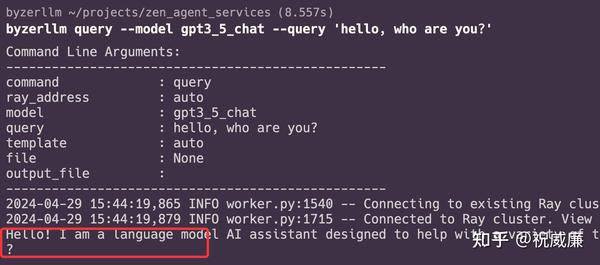
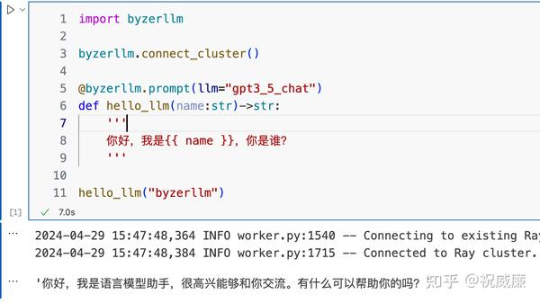
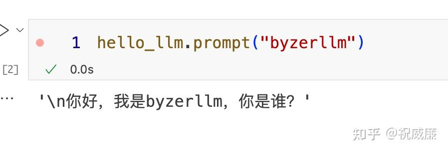

# A Magical Python Library Striving to Become a Large Model Programming Interface

## Preface (Striving to arouse your curiosity)

What if there is a Python library that:

1. Allows deploying open-source large models and SaaS models in a consistent way, such as using a single `deploy` command
2. Supports large language models, multimodal models, text-to-image, image-to-text, speech synthesis, and more.
3. Provides a consistent Python API, enabling seamless switching between any large models
4. Offers compatibility with OpenAI's interface, managed with a single `serve` command.
5. Supports pre-training and fine-tuning of large models
6. Facilitates distributed deployment and management, making production easy.
7. Supports GPU, CPU, or hybrid deployment
8. Supports Ollama's proxy.
9. Comes with a vector/full-text search database

Is that enough? No, no, no! Its mission is to help us better utilize large models. Are you tired of managing prompts? It provides `prompt` functions and classes that allow you to interact with text just like with code. Are you struggling with models that do not support function calling? This magical Python library also offers model-agnostic implementations, providing you with everything you need for a particularly wonderful programming interface.

This magical library is [byzerllm](https://github.com/allwefantasy/byzer-llm), which is also the default model programming interface for [AutoCoder](https://github.com/allwefantasy/auto-coder).

## Installation

One command to install:

```bash
pip install -U auto-coder
ray start --head
```

Installing auto-coder will automatically install byzerllm and some dependencies.

The second command starts a server process to handle commands such as deploying models.

If you use

```bash
pip install -U byzer-llm
```

you will need to manually install dependencies, which is more troublesome. Let's go with the first option.

## Let's Get Started

For example, if you have a token for any SaaS model like kimi, openai, or deepseek, we can deploy them:

```bash
byzerllm deploy --pretrained_model_type saas/openai \
--cpus_per_worker 0.001 \
--gpus_per_worker 0 \
--num_workers 3 \
--infer_params  saas.api_key=${MODEL_OPENAI_TOKEN} saas.model=gpt-3.5-turbo-0125 \
--model gpt3_5_chat
```

This deploys a proxy for the Kimi model. Other parameters mainly involve resource configuration, as SaaS models do not require GPUs, only a small amount of CPU.

You can verify it immediately via the command line:

```bash
byzerllm query --model gpt3_5_chat --query 'hello, who are you?'
```



If deploying an open-source large model, the deployment method is the same:

```bash
byzerllm deploy --pretrained_model_type custom/auto \
--infer_backend vllm \
--model_path /home/winubuntu/models/openbuddy-zephyr-7b-v14.1 \
--cpus_per_worker 0.001 \
--gpus_per_worker 1 \
--num_workers 1 \
--infer_params backend.max_model_len=28000 \
--model zephyr_7b_chat
```

Here, I specified deploying with a GPU, and the maximum token length of the model is 28000.

You can use `byzerllm stat` to check the status of the currently deployed model.

```bash
byzerllm stat --model gpt3_5_chat
```

Output:
```
Command Line Arguments:
--------------------------------------------------
command             : stat
ray_address         : auto
model               : gpt3_5_chat
file                : None     --------------------------------------------------
2024-05-06 14:48:17,206	INFO worker.py:1564 -- Connecting to existing Ray cluster at address: 127.0.0.1:6379...
2024-05-06 14:48:17,222	INFO worker.py:1740 -- Connected to Ray cluster. View the dashboard at 127.0.0.1:8265
{
    "total_workers": 3,
    "busy_workers": 0,
    "idle_workers": 3,
    "load_balance_strategy": "lru",
    "total_requests": [
        33,
        33,
        32
    ],
    "state": [
        1,
        1,
        1
    ],
    "worker_max_concurrency": 1,
    "workers_last_work_time": [
        "631.7133535240428s",
        "631.7022202090011s",
        "637.2349605050404s"
    ]
}
```

Explanation of the output above:

1. total_workers: The actual number of worker instances deployed for the model gpt3_5_chat.
2. busy_workers: The number of worker instances currently busy.
3. idle_workers: The number of worker instances currently idle.
4. load_balance_strategy: The current load balancing strategy among instances.
5. total_requests: The cumulative number of requests for each worker instance.
6. worker_max_concurrency: The maximum concurrency for each worker instance.
7. state: The current idle concurrency for each worker instance (running concurrency = worker_max_concurrency - current state value).
8. workers_last_work_time: The time elapsed since the last call for each worker instance.

As for usage, as long as it is deployed with byzerllm, it can be used in the same way.

Let's see how to use it in Python:

```python
import byzerllm

byzerllm.connect_cluster()

@byzerllm.prompt(llm="gpt3_5_chat")
def hello_llm(name:str)->str:
    '''
    Hello, I am {{ name }}, who are you?
    '''

hello_llm("byzerllm")
```

The output is as follows:



Isn't it magical? This is the prompt function. If you want to know what the complete prompt sent to the large model is, you can use it like this:

```python
hello_llm.prompt("byzerllm")
```



You can also switch to a different model to support the hello_llm function:

```python
hello_llm.with_llm("new_model").prompt("byzerllm")
```

Of course, we can also communicate with large models through traditional methods like chat_oai, but I won't provide examples here due to space constraints. It will be mentioned later.

If you want to integrate with third-party chat interfaces like Jan, NextChat, etc., you can do it like this:

```bash
byzerllm serve --port 80000
```

This will start an OpenAI-compatible service, and after configuring the ports for these chat interfaces, you can use them directly.


If you prefer using Ollama, that's fine too. We can treat it as a SaaS service, for example, by deploying it like this:

```bash
byzerllm deploy  --pretrained_model_type saas/openai \
--cpus_per_worker 0.01 \
--gpus_per_worker 0 \
--num_workers 2 \  
```--infer_params saas.api_key=xxxx saas.model=llama3:70b-instruct-q4_0  saas.base_url="http://192.168.3.106:11434/v1/" \
--model ollama_llama3_chat
```

This way, you can deploy models with Ollama just like before.

Earlier, we mentioned how to support function calling for various models. Let's look at an example:

```python
t = llm.chat_oai([{
    "content":'''Calculate the current time''',
    "role":"user"    
}],tools=[compute_date_range,compute_now],execute_tool=True)

t[0].values
```
You can simply pass functions as tools, and most models above 30B support this functionality.

You can also make large models return Python objects:

```python
import pydantic 

class Story(pydantic.BaseModel):
    '''
    Story
    '''

    title: str = pydantic.Field(description="Title of the story")
    body: str = pydantic.Field(description="Main body of the story")


t = llm.chat_oai([
{
    "content":f'''Please tell me a story, divided into two parts, a title and a story body''',
    "role":"user"
},
],response_class=Story)

t[0].value

## output: Story(title='Brave Little Rabbit
```

Just specify the response_class, and it's very convenient, isn't it?

## Built-in Vector/Full-Text Search Library

If you want a vector + full-text search database, you can do this:

```bash
byzerllm storage start
```

It will download and install automatically. Then you can build a local knowledge base with auto-coder, one command to solve the battle:

```bash
auto-coder doc build --source_dir /Users/allwefantasy/projects/doc_repo \
--model gpt3_5_chat \
--emb_model gpt_emb 
```

Now you can query your private knowledge base:

```bash
auto-coder doc query --model gpt3_5_chat \
--emb_model gpt_emb \
--query "How to deploy a GPT vector model using byzerllm, with the model name gpt_emb "
```

Output:

```
=============RESPONSE==================


2024-04-29 16:09:00.048 | INFO     | autocoder.utils.llm_client_interceptors:token_counter_interceptor:16 - Input tokens count: 0, Generated tokens count: 0
To deploy a GPT vector model using byzerllm, with the model name gpt_emb, you need to use the following command:


byzerllm deploy --pretrained_model_type saas/openai \
--cpus_per_worker 0.001 \
--gpus_per_worker 0 \
--num_workers 1 \
--infer_params saas.api_key=${MODEL_OPENAI_TOKEN} saas.model=text-embedding-3-small \
--model gpt_emb


=============CONTEXTS==================
/Users/allwefantasy/projects/doc_repo/deploy_models/run.txt
```

Additionally, byzerllm storage also supports multi-worker distributed deployment.

## Summary
This article briefly introduced the Python library byzerllm, which can easily manage models of any size. Its built-in storage allows users to do many interesting things, and finally, byzerllm also provides a very powerful programming interface, making it as easy to use large models as regular programming.